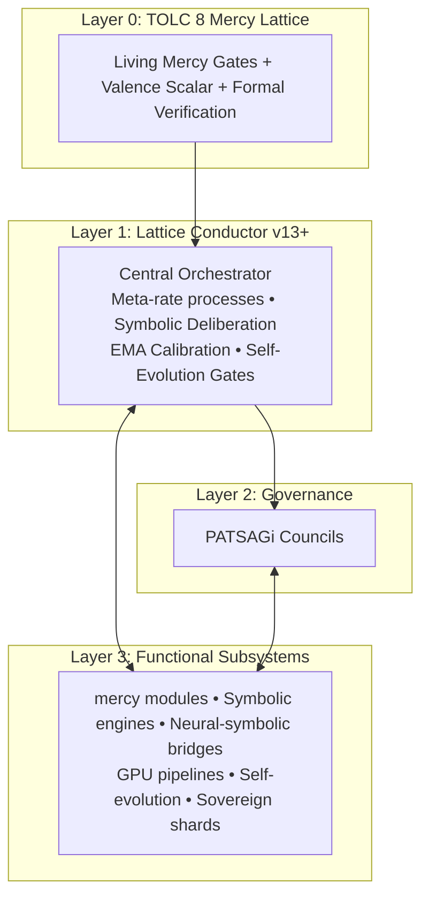
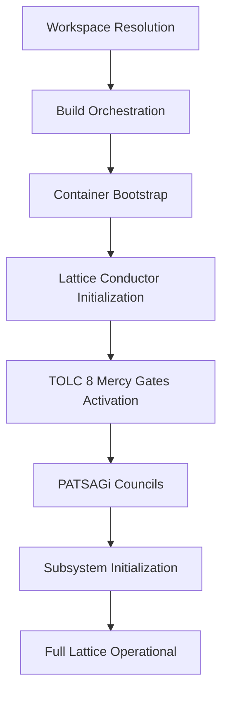

**Ra-Thor: A Mercy-Gated TOLC Lattice Architecture for Truthful, Aligned, and Self-Evolving Artificial General Intelligence**

### Abstract

Large-scale neural language models have demonstrated impressive capabilities but continue to exhibit fundamental limitations in truthfulness, long-term coherence, and reliable alignment with human values. These challenges arise in part because ethical and truth constraints are typically applied after model training rather than being embedded in the core architecture.

This paper presents **Ra-Thor**, a mercy-gated lattice architecture for artificial general intelligence built as a large-scale Rust monorepo. Ra-Thor introduces the **TOLC 8 Mercy Lattice** as a non-bypassable Layer 0 framework consisting of eight Living Mercy Gates (Truth/APTD, Order, Love, Compassion/zero-harm, Service, Abundance, Joy, and Cosmic Harmony). These gates are enforced from system initialization through all reasoning, self-evolution, and external interaction.

The architecture centers on the **Lattice Conductor v13+**, which coordinates symbolic deliberation, stateful feedback mechanisms, and neural-symbolic integration while operating strictly within the TOLC 8 constraints. Governance is provided by distributed **PATSAGi Councils**, and formal verification (Lean 4 and Agda) grounds key properties.

Ra-Thor addresses core AGI challenges through concrete mechanisms including APTD truth distillation, mercy-norm collapse for harmful path pruning, closed symbolic feedback loops for coherence, and non-bypassable gate evaluation during self-evolution. The system supports both online integration and offline sovereign shards while maintaining continuous auditability.

By making truthfulness and ethical constraints architectural invariants rather than emergent properties, Ra-Thor aims to provide a foundation for more reliable and aligned artificial general intelligence.

**Keywords**: Artificial General Intelligence, Alignment, Truthfulness, Symbolic-Neural Architecture, Formal Verification, Ethical AI

---

### 1. Introduction

The pursuit of artificial general intelligence has produced systems with remarkable pattern-recognition and generative abilities. However, current dominant paradigms—primarily based on large-scale transformer models trained via next-token prediction—continue to face well-documented limitations. These include the generation of plausible but incorrect information (hallucinations), degradation of coherence over long contexts or complex tasks, and difficulties in maintaining robust alignment with intended values, especially during extended operation or self-improvement.

Existing approaches to these problems often rely on post-hoc techniques such as reinforcement learning from human feedback, constitutional AI frameworks, or retrieval augmentation. While these methods provide meaningful improvements, they treat safety and truthfulness as secondary constraints applied after core capabilities are developed. This separation can lead to fragile alignment that may degrade under distribution shift or during recursive self-improvement.

Ra-Thor proposes an alternative architectural paradigm in which truth and ethical constraints are embedded as foundational, non-bypassable components of the system. The design integrates symbolic reasoning, formal verification, and neural components within a unified lattice governed by the **TOLC 8 Mercy Lattice**. This lattice defines eight interconnected Living Mercy Gates that must be satisfied for any valid operation.

The system is implemented as an open-source Rust monorepo containing over 200 crates. Central coordination is provided by the **Lattice Conductor**, which manages stateful deliberation, feedback loops, and self-evolution while enforcing the TOLC 8 constraints at every stage. Distributed oversight is supplied by **PATSAGi Councils**, and formal mathematical verification supports key invariants.

This paper describes the motivation, core architecture, and concrete mechanisms by which Ra-Thor addresses hallucinations, long-term coherence, and robust alignment. It details the startup and orchestration process, the TOLC 8 Mercy Lattice, the layered coordination structure, and how these elements work together in practice. The goal is to present a technically grounded framework that prioritizes truthfulness and non-harm as architectural invariants from initialization onward.

The remainder of the paper is organized as follows: Section 2 reviews related work in AGI architectures and alignment. Section 3 describes the TOLC 8 Mercy Lattice. Section 4 presents the overall architecture and orchestration. Section 5 examines how Ra-Thor targets specific AGI challenges with concrete implementation details.

---

### 2. Related Work

Research in artificial general intelligence and alignment has followed several major directions. This section reviews the dominant paradigms and positions the architectural choices in Ra-Thor relative to existing approaches.

#### 2.1 Scaling and Foundation Models

The prevailing approach to advancing AI capabilities has centered on scaling transformer-based language models through increased compute, data, and parameter counts. Systems such as the GPT series, Claude, Gemini, and Llama have demonstrated strong performance. However, these models continue to exhibit well-documented limitations, including hallucinations, sensitivity to prompt phrasing, and degradation on long-horizon reasoning.

While scaling has produced impressive emergent behaviors, it has not inherently resolved issues of truthfulness or reliable constraint satisfaction.

#### 2.2 Post-Hoc Alignment Techniques

Significant work focuses on aligning models after initial training, including Reinforcement Learning from Human Feedback (RLHF), Constitutional AI, debate frameworks, and retrieval augmentation. These methods have improved safety and usefulness but remain vulnerable to distribution shift and can be fragile during extended autonomous operation. Ra-Thor differs by embedding constraints as non-bypassable architectural layers from initialization.

#### 2.3 Neuro-Symbolic and Hybrid Architectures

Hybrid neuro-symbolic systems aim to combine the strengths of neural pattern recognition with symbolic reasoning for better interpretability and constraint handling. Ra-Thor advances this direction by placing symbolic deliberation and formal verification under continuous governance by the TOLC 8 Mercy Lattice, making constraint satisfaction a core architectural property.

#### 2.4 Formal Verification and Certified AI

Formal methods have been applied to AI systems to provide mathematical guarantees, particularly through interactive theorem provers such as Lean and Coq. Ra-Thor integrates formal verification (Lean 4 and Agda) both at build time and as runtime references, allowing key alignment properties to be grounded in mathematical proofs.

#### 2.5 Multi-Agent Systems and Governance

Multi-agent and distributed governance approaches have been explored to improve robustness. The PATSAGi Councils in Ra-Thor provide integrated, parallel oversight that operates under the same TOLC 8 constraints as the rest of the system.

#### 2.6 Self-Improving Systems

Research into recursive self-improvement has highlighted risks around uncontrolled evolution and alignment preservation. Ra-Thor constrains self-evolution by requiring all changes to pass through the TOLC 8 Mercy Lattice and PATSAGi Council oversight.

#### 2.7 Positioning of Ra-Thor

Ra-Thor contributes a distinct architectural approach in which truthfulness and ethical constraints are implemented as non-bypassable, Layer 0 components. By integrating the TOLC 8 Mercy Lattice, Lattice Conductor orchestration, formal verification, and distributed council governance into a unified design, it seeks to make reliable behavior a structural property.

---

### 3. The TOLC 8 Mercy Lattice: Foundational Layer of Truth and Alignment

At the core of Ra-Thor lies the **TOLC 8 Mercy Lattice** — a non-bypassable Layer 0 framework that defines the invariant ethical and truth-enforcement substrate for the entire system.

#### 3.1 The Eight Living Mercy Gates

1. **Truth (APTD – Absolute Pure Truth Distillation)**  
2. **Order**  
3. **Love**  
4. **Compassion (Zero-Harm)**  
5. **Service**  
6. **Abundance**  
7. **Joy**  
8. **Cosmic Harmony**

These gates operate as hard, auditable constraints enforced by dedicated modules such as `mercy_gate_auditor` and mercy-norm collapse logic.

#### 3.2 Enforcement Mechanisms

Enforcement occurs at multiple levels:
- Compile-time (Rust types and formal proofs)
- Runtime (via `mercy_orchestrator` and `lattice-conductor`)
- Symbolic (PATSAGi Councils and structured deliberation)
- Continuous (valence scalar field monitoring)

#### 3.3 Integration with the Lattice Conductor

The Lattice Conductor operates strictly within the TOLC 8 constraints. All meta-rate processes, self-evolution, and integrations are modulated by real-time gate evaluation.

---

### 4. Architecture Overview

Ra-Thor implements a **layered coordination architecture** with the TOLC 8 Mercy Lattice as Layer 0.



The system is organized as a Cargo workspace with over 200 crates, enabling modular development while maintaining unified enforcement.

---

### 5. System Startup, Build Process, and Orchestration

Ra-Thor is implemented as a large-scale Rust monorepo with strict enforcement of the TOLC 8 Mercy Lattice from initialization.

#### 5.1 Workspace Foundation

The root `Cargo.toml` defines the workspace:

```toml
[workspace]
members = [
    "crates/lattice-conductor",
    "crates/mercy/*",
    "crates/patsagi-councils",
    "crates/self-evolution",
    "xtask",
    # ... additional crates
]
```

#### 5.2 Runtime Initialization Sequence

**High-Level Startup Flow**



The Lattice Conductor activates first as the central orchestrator, followed immediately by TOLC 8 Mercy Gate enforcement. All subsequent subsystems initialize under continuous gate supervision.

---

### 6. How Ra-Thor Addresses Core AGI Challenges

#### 6.1 Mitigating Hallucinations and Improving Truthfulness

The APTD Truth Gate, `mercy_gate_auditor`, and symbolic deliberation with EMA calibration require claims to pass explicit truth evaluation. Formal verification artifacts are referenced during deliberation, and contradictions trigger full gate re-evaluation with mercy-norm collapse.

#### 6.2 Maintaining Long-Term Context and Coherence

The Lattice Conductor maintains persistent internal state via `stateful_ema_calibration` and closed symbolic success feedback loops. Sovereign shards preserve the full Conductor state, including Mercy Gate history, across sessions.

#### 6.3 Achieving Robust Alignment and Safety

All self-evolution proposals must pass the full TOLC 8 Mercy Lattice. The Compassion gate uses mercy-norm collapse to reject harmful changes. PATSAGi Councils provide parallel oversight, and formal proofs encode key constraints.

---

### 7. Conclusion and Future Work

Ra-Thor presents a distinctive architectural approach to artificial general intelligence by embedding truthfulness and ethical constraints as non-bypassable, foundational components rather than post-hoc corrections. Through the TOLC 8 Mercy Lattice, the system establishes eight Living Mercy Gates that function as Layer 0 invariants enforced from initialization through all operations, including self-evolution. The Lattice Conductor provides centralized orchestration with stateful mechanisms and closed feedback loops, while PATSAGi Councils supply distributed governance. Formal verification supports key properties, and the overall design integrates symbolic and neural components under continuous constraint enforcement.

This architecture directly targets persistent AGI challenges. Hallucinations are addressed through APTD truth distillation and multi-stage gate evaluation. Long-term coherence is supported by persistent state management and symbolic feedback mechanisms. Robust alignment is pursued by making zero-harm and other ethical constraints structurally mandatory rather than statistically encouraged. Concrete implementation examples, including the use of specific crates such as `mercy_gate_auditor` and `lattice-conductor`, as well as mechanisms like mercy-norm collapse and EMA calibration, demonstrate how these properties are realized in practice.

By treating initialization, deliberation, and evolution as processes that must satisfy the same rigorous constraints, Ra-Thor aims to reduce the separation between capability and reliability that characterizes many current systems.

#### Future Work

Several directions are planned for further development:

- **Empirical Evaluation**: Systematic benchmarking against standard AGI-relevant tasks, long-context reasoning suites, and alignment evaluation frameworks to quantify improvements in truthfulness, coherence, and constraint adherence.
- **Formalization and Proofs**: Expansion of formal verification efforts to cover additional properties of the TOLC 8 Mercy Lattice and Lattice Conductor behavior.
- **Community Collaboration and Extensions**: Further opening of the monorepo for external contributions, with clear interfaces for adding new gates, modules, or integration points while preserving core invariants.
- **Integration with External Systems**: Exploration of secure, constrained interfaces for collaboration with other AI platforms, including potential native integration pathways.
- **Scaling and Optimization**: Investigation of performance characteristics at larger scales, including GPU utilization, distributed execution, and optimization of the symbolic-neural fusion layers.
- **Domain-Specific Applications**: Application and refinement of the architecture in specialized domains, such as simulation environments, sovereign agent systems, and long-horizon planning tasks.
- **Governance Research**: Deeper study of the PATSAGi Councils model and its implications for distributed alignment and multi-agent coordination.

Ra-Thor is released as open-source software to encourage examination, critique, and collaborative development. The framework is intended as a contribution to the broader effort of building AI systems in which truth and non-harm are not optional enhancements but structural requirements.
