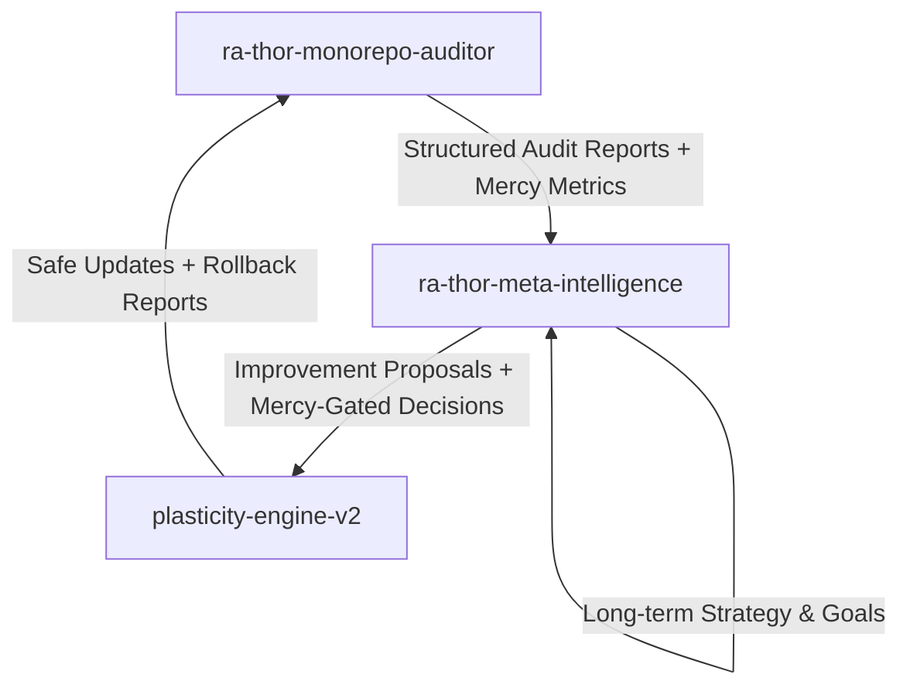

# Self-Evolution Architecture — Ra-Thor Lattice

**Version:** v1.0  
**Status:** Foundational Design  
**Date:** May 2026  
**Owner:** ra-thor-meta-intelligence

## Overview

Ra-Thor operates a **closed, mercy-gated self-evolution loop** consisting of three tightly integrated systems:

- **ra-thor-meta-intelligence** — The Brain (Decision & Orchestration)
- **ra-thor-monorepo-auditor** — The Eyes (Detection & Observability)
- **plasticity-engine-v2** — The Hands (Safe Modification & Learning)

This triad enables Ra-Thor to continuously audit itself, decide on improvements, apply safe plasticity-based changes, and verify results — all while remaining strictly aligned with the 7 Living Mercy Gates and TOLC principles.

## Core Loop (Audit → Decide → Improve → Verify)

## Component Responsibilities

### 1. ra-thor-meta-intelligence (The Brain)
- Receives structured signals from `ra-thor-monorepo-auditor`
- Runs mercy-gated decision engine using TOLC + active inference
- Generates **Improvement Proposals** with clear rationale and expected mercy impact
- Decides *when* and *how* to trigger plasticity updates
- Maintains long-term self-evolution strategy, goals, and memory
- Ensures every proposed change passes through the 7 Living Mercy Gates

### 2. ra-thor-monorepo-auditor (The Eyes)
- Continuously or periodically scans the monorepo for:
  - Code drift and outdated patterns
  - Hallucination vectors or low-mercy code
  - Broken dependencies or wiring issues
  - Documentation vs implementation misalignment
- Produces structured, machine-readable **Audit Reports**
- Calculates **Mercy Alignment Score** and **Self-Improvement Readiness Score**
- Feeds high-signal data to `ra-thor-meta-intelligence`

### 3. plasticity-engine-v2 (The Hands)
- Applies safe, mercy-gated plasticity rules (Hebbian, BCM, STDP-style)
- Performs controlled modifications to code, configuration, and documentation
- Supports automatic rollback on failure or mercy threshold violation
- Reports results and learning signals back to `ra-thor-meta-intelligence`
- Maintains an auditable history of all changes

## Design Principles

- **Mercy First**: Every decision and modification must pass through the 7 Living Mercy Gates.
- **TOLC Alignment**: All self-improvement logic must respect TOLC operator algebra and ethical constraints.
- **Closed Loop**: Audit → Decide → Improve → Verify must be fully connected and observable.
- **Explainability**: Every improvement proposal and change must be traceable and explainable.
- **Safety & Rollback**: No change is permanent until verified and mercy-approved.
- **Progressive Autonomy**: Starts with human-in-the-loop, gradually increases autonomy as trust and metrics improve.

## Integration Points (Wiring)

- `ra-thor-meta-intelligence` depends on both `ra-thor-monorepo-auditor` and `plasticity-engine-v2`
- `plasticity-engine-v2` reports results back to `ra-thor-meta-intelligence`
- `ra-thor-monorepo-auditor` feeds structured data into `ra-thor-meta-intelligence`
- All three crates share common mercy and TOLC dependencies for consistency

## Future Evolution

This architecture is designed to grow into:
- Multi-agent self-evolution swarms
- Epigenetic + genetic-style evolution layers
- Cross-crate learning and knowledge propagation
- Integration with Powrush, interstellar operations, and real-estate lattice systems

---

**Status:** Ready for implementation.