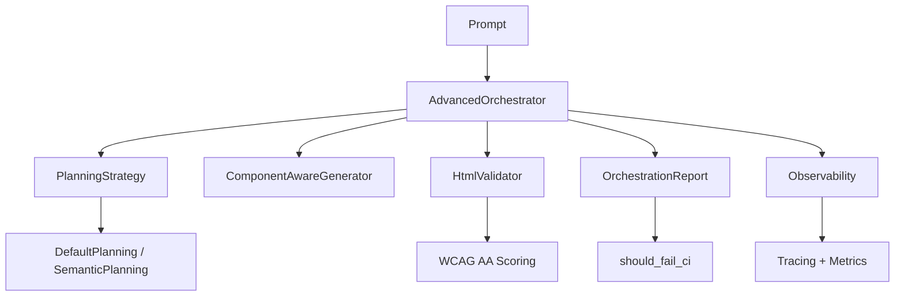
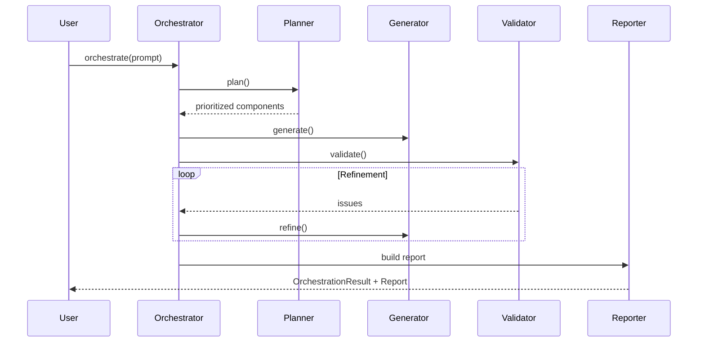
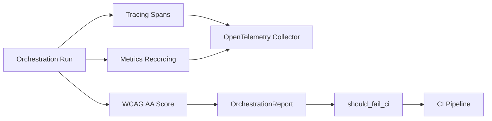
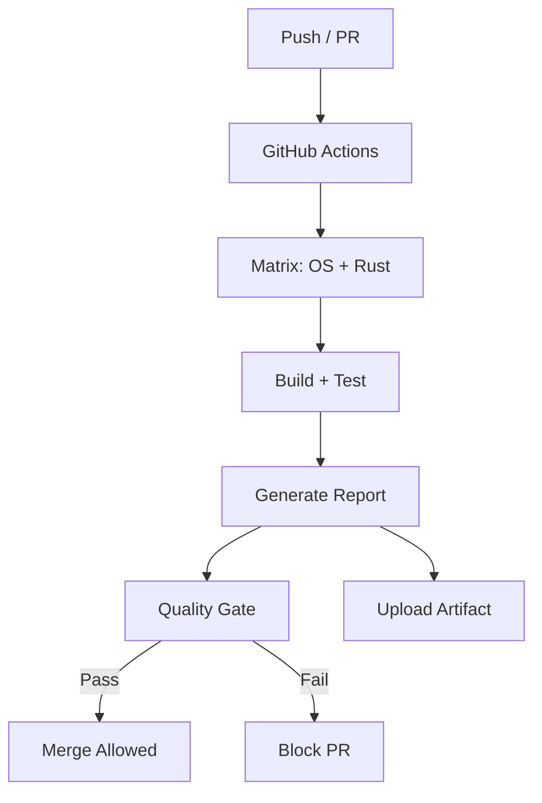

# web-forge Architecture

This document provides visual overviews of the `web-forge` system components and flows.

## 1. Overall System Architecture

## 2. Orchestration Flow

## 3. Observability + Reporting Pipeline

## 4. CI Integration Flow

